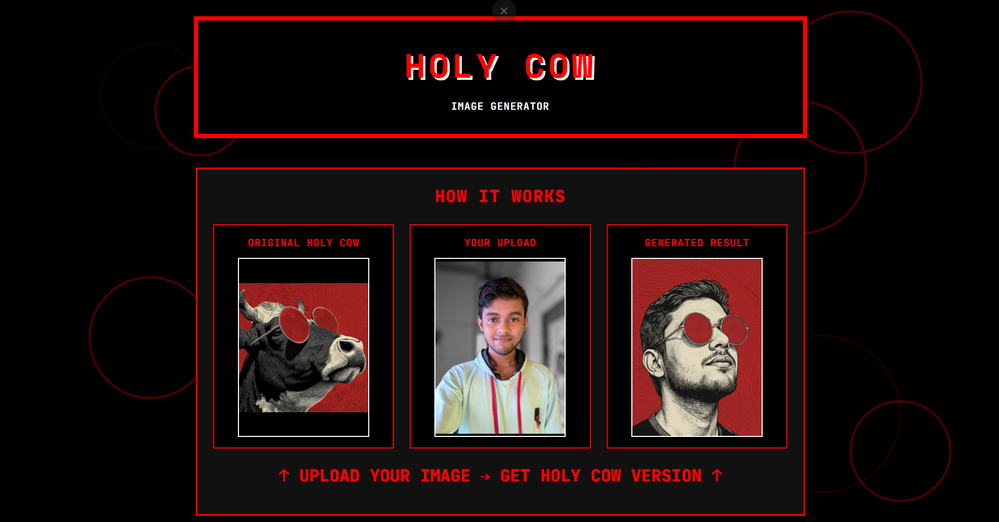

## Overview

When OpenAI's GPT-Image-1 released it came with the Ghibli trend. So why Nano-Banana gets no trend like that? For that sole purpose, here is a fun project to "Holy Cow" your image.

Visit the [Website](https://holy-cow-t11a.onrender.com)

## Features

- **Image Upload**: Support for PNG, JPG, JPEG, GIF, BMP
- **AI Generation**: Google Gemini Nano Banana for style transfer and face replacement in few seconds
- **Responsive Design**: Mobile-friendly web interface
- **Download Support**: Save generated images directly

## Quick Start for Developers

### 1. Setup Environment

```bash
git clone <repository-url>
cd Holy_Cow
python -m venv holy_cow_env
holy_cow_env\Scripts\activate  # Windows
pip install -r requirements.txt
```

### 2. Configure API Keys

Create `.env` file:
```env
GEMINI_API_KEY=your_primary_gemini_api_key_here
FALLBACK_GEMINI_API_KEY=your_backup_gemini_api_key_here
```

### 3. Run Application

```bash
python app.py
```

Visit `http://localhost:10000`

## How It Works

1. **Upload** your photo
2. **Generate** AI-styled image 
3. **Download** the result

## Project Structure

```
Holy_Cow/
├── app.py                    # Main Flask application
├── src/generator.py          # AI image generation
├── Templates/                # HTML templates  
├── artifacts/                # Images (reference + generated)
├── config/paths.py           # File paths
└── utils/                    # Logging & error handling
```

## Dependencies

- **Flask 3.1.2** - Web framework
- **google-genai 1.32.0** - Gemini API client
- **Pillow 11.3.0** - Image processing

## Note

None of the generated or uploaded images to the website are saved by any means. The optional API key is also not saved or logged.

## License

MIT License - see [LICENSE](LICENSE) for details.